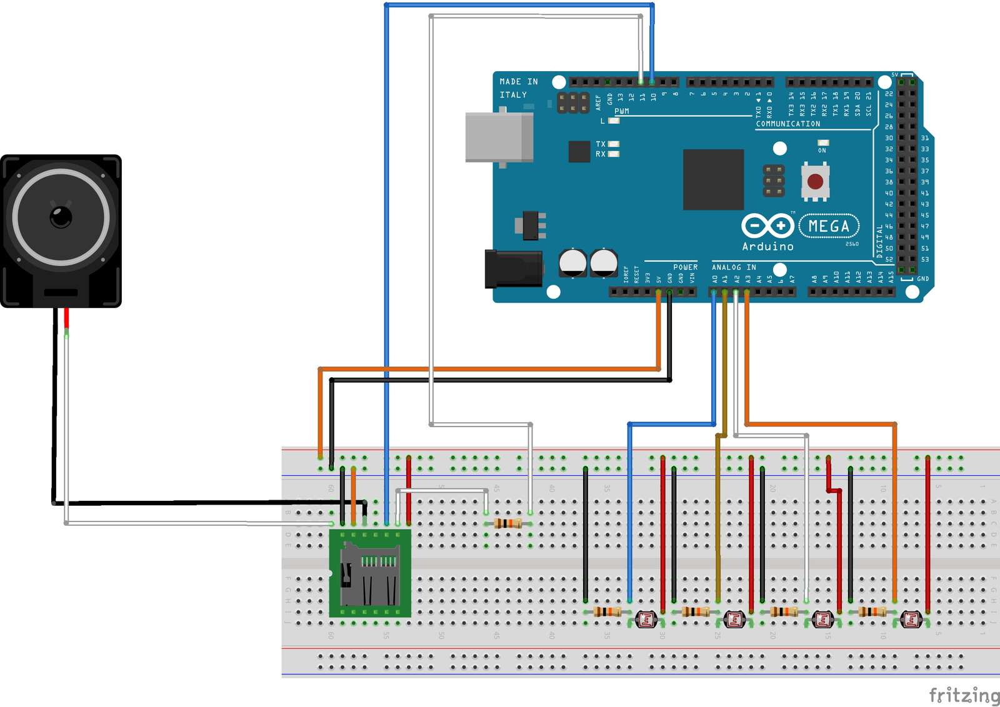

# Pianoscalier: Un escalier transformé en piano

Ce projet permet de transformer un escalier ordinaire en un piano géant. Chaque marche détecte le passage d'une personne à l'aide d'un système de barrière laser et déclenche un son spécifique via un module MP3. Une interface web permet de configurer en temps réel la note ou la piste audio associée à chaque marche.

## Fonctionnement

Le système repose sur une communication entre une interface web et un Arduino :

1. Détection : Des photorésistances (LDR) reçoivent un faisceau laser. Lorsqu'une personne pose le pied sur une marche, le faisceau est coupé, la luminosité baisse, et l'Arduino détecte l'événement.
2. Audio : L'Arduino commande un module DFPlayer Mini pour jouer le fichier MP3 correspondant à la marche.
3. Contrôle Web : Une interface HTML/JS communique avec un serveur Node.js via Socket.io. Le serveur transmet les commandes de configuration à l'Arduino par liaison série (USB).

## Matériel requis (Pour 4 marches)

* 1 Arduino (Uno ou Mega)
* 1 Module DFPlayer Mini (mp3-tf-16p)
* 4 Photorésistances (LDR)
* 4 Lasers basse consommation
* 4 Résistances de 10k ohms (pour les LDR)
* 1 Résistance de 1k ohm (pour la protection du port RX du DFPlayer)
* 1 Haut-parleur (8 ohms)
* 1 Carte Micro SD (formatée en FAT32)
* Pleins de cables Arduino

## Branchements

## Installation

### Configuration de la carte SD

Les fichiers audio doivent être placés à la racine de la carte SD ou dans un dossier nommé MP3. Ils doivent être nommés avec quatre chiffres :

* 0001.mp3
* 0002.mp3
* 0003.mp3
* etc...

Vous pouvez utiliser les fichiers fournis dans ce projet

### Configuration logicielle

1. Téléversez le code Arduino situé dans le dossier arduino/ sur votre carte.
2. Installez Node.js sur votre ordinateur.
3. Dans le dossier du projet, installez les dépendances nécessaires :
npm install
4. Identifiez le port COM de votre Arduino (ex: COM3 ou /dev/ttyUSB0) et modifiez-le dans le fichier server.js.

### Configuration matérielle

1. Placez une photorésistance par marche
2. Placez les lasers à l'opposé, de sorte qu'ils pointent sur les photorésistances
3. Appuyez sur le bouton RESET de la carte Arduino

## Lancement

1. Branchez l'Arduino en USB à l'ordinateur.
2. Lancez le serveur Node.js :
node server.js
3. Ouvrez votre navigateur à l'adresse suivante :
http://localhost:3000

## Utilisation

* Interface : Cliquez sur une marche pour ouvrir le piano virtuel et assigner une nouvelle note.
* Presets : Le bouton Musique 1 configure automatiquement les marches pour la music Rat Dance.

## Auteurs

Projet réalisé par Rojhat YILMAZ, Kaï DJEPAXHIA, Alexis BURGOD, Medelys SEUX et Lucille GONTARD.